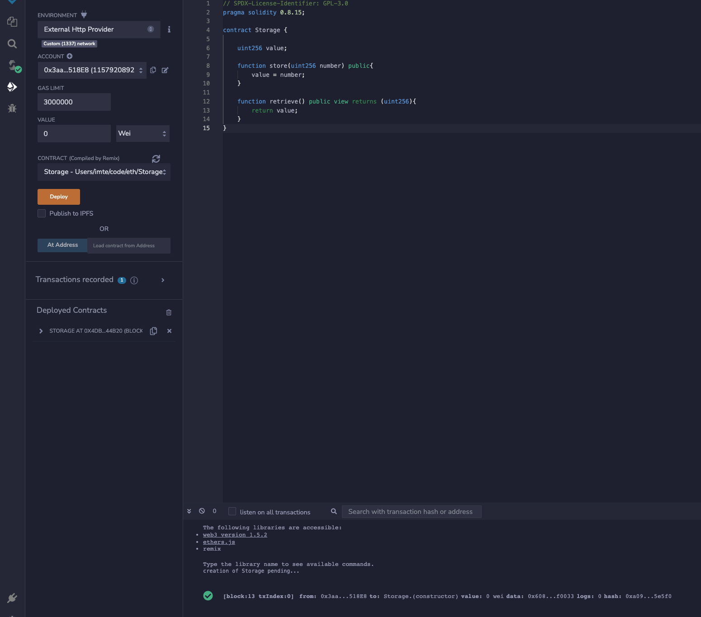

1. 启动一个geth开发环境dev节点
```shell
geth --identity "witness" --http --http.port 8545 --http.api "net,personal,eth,web3,db" --datadir "witness" --networkid 33 --allow-insecure-unlock
```
此时可在终端中执行命令行：
```shell
# 获取当前块号
eth.blockNumber
# 获取块详情
eth.getBlock(6)
# 账号地址
eth.coinbase
# 获取账号余额
eth.getBalance("0x3aa6b0ebf7453d0b19a6d264fe262721b53518e8")
# 开始挖矿，参数指定进程数量
miner.start(1)
# 停止挖矿
miner.stop()
# 是否在挖矿
eth.mining
```
详细命令请参考[文档](https://geth.ethereum.org/docs/interacting-with-geth/javascript-console#interactive-use)
2. 编写智能合约Storage.sol
```
// SPDX-License-Identifier: GPL-3.0
pragma solidity 0.8.15;

contract Storage {

	uint256 value;

	function store(uint256 number) public{
		value = number;
	}

	function retrieve() public view returns (uint256){
		return value;
	}
}
```
3. 部署合约
Remix IDE中`Deploy & run transactions`区域选择`External Http Provider`，选择有余额的账户，点击`Deploy`


4. 生成字节码
在Remix IDE编译页面找到`ABI`按钮，点击复制，在项目目录下创建`Storage.abi`文件，将复制的内容粘贴到文件中，运行以下命令得到字节码：
```shell
solc --bin Storage.sol -o Storage.bin
```
使用`abigen`生成go文件
```shell
abigen --abi Storage.abi --pkg main --type Storage --out Storage.go --bin Storage.bin
```

5. 在go代码中与合约交互
```go
package main

import (
	"eth_data_dir/contranct"
	"fmt"
	"github.com/ethereum/go-ethereum/accounts/abi/bind"
	"github.com/ethereum/go-ethereum/common"
	"github.com/ethereum/go-ethereum/ethclient"
	"log"
	"math/big"
	"strings"
)

const key = `{"address":"3aa6b0ebf7453d0b19a6d264fe262721b53518e8","crypto":{"cipher":"aes-128-ctr","ciphertext":"be6400ad1e06e19031d46503a63f4b92217afee00b2b9a337e47eed39d494900","cipherparams":{"iv":"c310dd0f827ff0fcc068fd99a8d54df6"},"kdf":"scrypt","kdfparams":{"dklen":32,"n":4096,"p":6,"r":8,"salt":"bd045bbf44070ffcf38f31e6b5fc968370898b2e16d96c1da9590826385c76e5"},"mac":"35f8fd5b75da6e6cd24f0657cadf0edf75306ceff00b9e7dfbfa1e4e70fb1843"},"id":"f6f11869-1f62-4e14-becb-7bdaa59a2d3a","version":3}`
const contractAddress = "0x4dBE43FEF09F629D3bAC5F3a77a504c577944b20"

func main() {
	conn, err := ethclient.Dial("http://127.0.0.1:8545")
	if err != nil {
		log.Fatalf("Failed to connect to the Ethereum client: %v", err)
	}

	// 创建storage实例
	storage, err := contranct.NewStorage(common.HexToAddress(contractAddress), conn)
	if err != nil {
		log.Fatalf("Failed to instantiate Storage contract: %v", err)
	}

	// console中执行eth.chainId()得到chainID
	tx, err := bind.NewTransactorWithChainID(strings.NewReader(key), "", big.NewInt(0x539))
	if err != nil {
		log.Fatalf("Failed to create transaction")
	}

	// 调用storage.store()
	_, err = storage.Store(tx, big.NewInt(2))
	if err != nil {
		log.Fatalf("Failed to store number: %v", err)
	}

	// 调用storage.retrieve()
	number, err := storage.Retrieve(&bind.CallOpts{Pending: true})
	if err != nil {
		log.Fatalf("Failed to retrieve number: %v", err)
	}
	fmt.Println(number)
}
```
